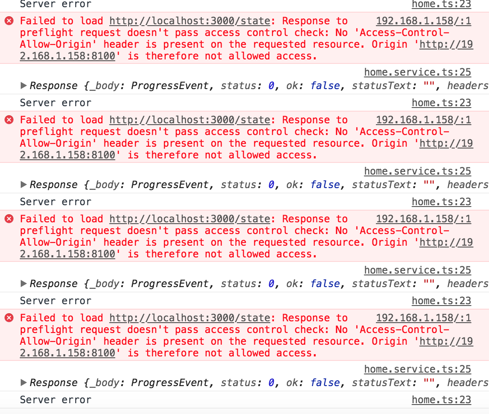
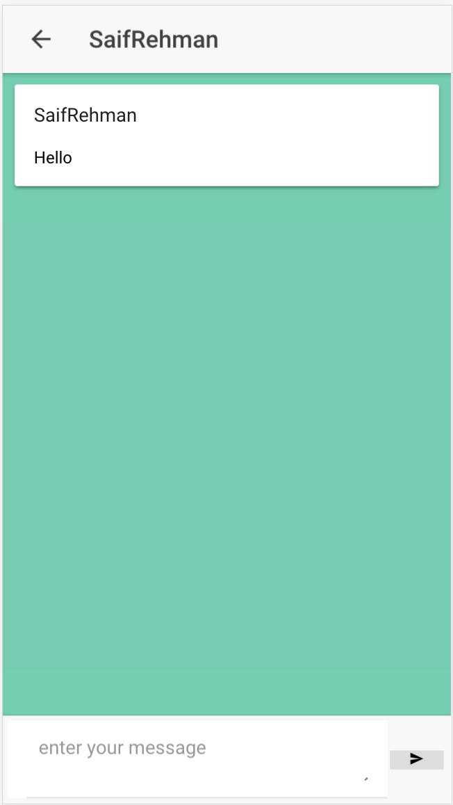

<h1 align="center">
  <br>
  <a href="https://github.com/SaifRehman/tendermint-chat-app"></a>
  <br>
      Blockchain Chat App
  <br>
  <br>
</h1>

<h4 align="center">Blockchain Chat App with  ✨ Lotion ✨  and IBM Cloud</h4>

<p align="center">
  <a>
    
  </a>
</p>
<br>

Table of Contents
=================

   * [Running the Blockchain locally](#running-the-blockchain-locally)
   * [Run FrontEnd Mobile Application locally](#run-frontend-mobile-application-locally)
   * [Deploying to IBM Cloud as a Cloud Foundry application](#deploying-to-ibm-cloud-as-a-cloud-foundry-application)
   * [Cors issue fix](#cors-issue-fix)
   * [Docker Support](#docker-support)
   * [Tendermint Api Documentation](#tendermint-api-documentation)


## Contributors

| [<br /><sub><b>SaifRehman</b></sub>](https://www.linkedin.com/in/saif-ur-rehman/)<br />[💻](https://github.com/SaifRehman/watsonic/commits?author=SaifRehman "Code") [📖](https://github.com/SaifRehman/tendermint-chat-app/commits?author=SaifRehman "Documentation") [🤔](#ideas-keppel "Ideas, Planning, & Feedback") [⚠️](https://github.com/SaifRehman/tendermint-chat-app/commits?author=SaifRehman "Tests") | [<br /><sub><b>Jacob Gadikian</b></sub>](https://www.linkedin.com/in/jacobgadikian/)<br />[💻](https://github.com/SaifRehman/tendermint-chat-app/commits?author=faddat "Code") [🤔](#ideas-mappum "Ideas, Planning, & Feedback") [⚠️](https://github.com/SaifRehman/tendermint-chat-app/commits?author=sudoalgorithm "Tests") [🔌](#plugin-mappum "Plugin/utility libraries")| [<br /><sub><b>Kunal Malhotra</b></sub>](https://www.linkedin.com/in/knrmalhotra/)<br />[💻](https://github.com/SaifRehman/tendermint-chat-app/commits?author=sudoalgorithm "Code") [🤔](#ideas-mappum "Ideas, Planning, & Feedback") [⚠️](https://github.com/SaifRehman/tendermint-chat-app/commits?author=sudoalgorithm "Tests") [🔌](#plugin-mappum "Plugin/utility libraries")
| :---: | :---: | :---: |
## Tendermint Blockchain Chat App


This is minimal chat application based on Tendermint Consensus Engine using Lotionjs. It also includes web/mobile application built using Ionic 3.

### Creating Genesis file with 2 validators

1. Navigate to creatingGenesisFile directory
``` cd creatingGenesisFile ```
2. Install dependencies
``` npm i ```
3. How Genesis file looks currently with no validators
``` JSON
{
    "genesis_time": "0001-01-01T00:00:00Z",
    "chain_id": "name",
    "validators": [
    ],
    "app_hash": ""
}
```
4. Generate 2 validators
```
$ ./node_modules/lotion/bin/tendermint gen_validator > privkey0.json
$ ./node_modules/lotion/bin/tendermint gen_validator > privkey1.json
```
5. How private key looks like, it has public and private key randomly generated
```JSON
{
	"address": "B809574EC51377DE48454094BF3302989CBB50A9",
	"pub_key": {
		"type": "ed25519",
		"data": "8A049817BA6D1B065C30D927A529AAFA7147BE0D147E1CCD7A25FAADBE80C8D0"
	},
	"priv_key": {
		"type": "ed25519",
		"data": "57BAFDD6136E1140FA9F906313BF2CFC75802F044704DD7AAF30BC1010E6519C8A049817BA6D1B065C30D927A529AAFA7147BE0D147E1CCD7A25FAADBE80C8D0"
	}
}
```

6. Copy only public key information and paste in genesis.json, this how it will look like in the end after adduing two validators
```JSON
{
    "genesis_time": "0001-01-01T00:00:00Z",
    "chain_id": "name",
    "validators": [
        {
            "pub_key": {
                "type": "ed25519",
                "data": "8A049817BA6D1B065C30D927A529AAFA7147BE0D147E1CCD7A25FAADBE80C8D0"
            },
            "power": 10,
            "name": "saif"
        },
        {
            "pub_key": {
                "type": "ed25519",
                "data": "5FD1FBF59759E50BD1C23911E832198AB78A4F7E6F1F23A64AAFEC5992608CA8"
            },
            "power": 20,
            "name": "prerna"
        }
    ],
    "app_hash": ""
}
```
* You add Power and Name of validators as well 

### Running the blockchain locally
1. Navigate to blockchain dir 
```
$ cd cf
```
2. Install dependencies 
```
$ npm i 
```
3. Run the Blockchain
``` 
$ node app.js
```


Your tendermint port is 46667

1. Endpoint: http://localhost:8080/get (GET), shows current data in blockchain
2. Endpoint: http://localhost:8080/post (POST), post new data in blockchain
3. Endpoint: http://localhost:46657/ , access available Apis provided by Tendermint RPC 


End points available through ABCI (Application blockchain interface) :)

How simple can that be?

## Run FrontEnd Mobile Application locally
1. Navigate to frontend dir
```
$ cd frontend
```
2. Install dependencies
```
$ npm i
```
3. Install ionic cli 
```
$ npm i -g ionic cordova
```
4. Run the app
```
$ ionic serve
```
5. App running on port 8100
```
http://localhost:8100
```
## CORS Issue Fix 
If you face error as such 


1. Install "Allow-Control-Allow-Origin: *" plugin of google chrome to enable CORS

link: [Allow-Control-Allow-Origin: *](https://chrome.google.com/webstore/detail/allow-control-allow-origi/nlfbmbojpeacfghkpbjhddihlkkiljbi?hl=en)

2. Enable CORS 


## Docker Support 
1. Navigate to blockchain directory
```
$ cd docker
```
2. Build image from Dockerfile
```
$ docker build -t tendermint .
```
3. Run Dockerfile
```
$ docker run -p 8080:8080 -p 46657:46657 -d tendermint:latest
```
4. See the running container
```
$ docker ps
```
5. Stop the container
```
$ docker stop containerid
``` 
6. Remove Container
```
$ docker rm containerid
```

## Deploying to IBM Cloud as a Cloud Foundry application
1. Signup to [IBM Cloud](http://ibm.biz/ioblockchain)
2. Install [Cloud Foundry CLI](https://docs.cloudfoundry.org/cf-cli/install-go-cli.html)
3. Open ```manifest.yml``` and give app a name
4. Open command line and type 
```
$ cf login -a https://api.ng.bluemix.net -u <ibm.com id>
``` 
5. Navigate to ```cf``` directory 
```
$cd cf
```
6. Push the Application to IBM Cloud
```
$ cf push
```
7. Copy the URL generated Cloud Foundry
8. Open ```frontend/src/pages/congif/config.ts``` , and change the baseurl to the url you copied.
9. Navigate to frontend dir
```
$ cd frontend
```
10. Build the production ready web app by ionic cli
```
$ ionic cordova build browser
```
11. Navigate to ```frontend/platforms/browser```. Copy ```www``` folder and paste in ```cf``` folder
12. Push the app, this will have a fully functional Blockchain with a sexy frontend build with ionic <3
```
$ cf push
```

## Tendermint Api Documentation
| Endpoint      | Type          | Payload|
| ------------- |:-------------:| -----:|
| /api/get    | GET | - |
| /api/abci_info    | GET | - |
| /api/dump_consensus_state     | GET      |   - |
| /api/genesis | GET      |    - |
| /api/net_info | GET   |    -|
| /api/num_unconfirmed_txs| GET     |   - |
| /api/status| GET     |    - |
| /api/unconfirmed_txs | GET     |   - |
| /api/abci_query | POST      |    {"path":"","data":"","height":0,"prove":""} |
| /api/block |POST     |    {"height":0} |
| /api/block_results |POST      |     {"height":0} |
| /api/blockchain| POST      |    {"minHeight":0,"maxHeight":100} |
| /api/broadcast_tx_async|POST     |    {"tx":""}|
| /api/broadcast_tx_commit | POST     |    {"tx":""} |
| /api/broadcast_tx_sync | POST      |    {"tx":""} |
| /api/commit |POST    |     {"height":0}|
| /api/subscribe |POST      |    {"query":""} |
| /api/tx | POST      |    {"hash":"","prove":""}  |
| /api/tx_search' | POST     |    {"query":"","prove":""} |
| /api/post    | POST | {"sender":"","message":""} |


## Screenshot of App





